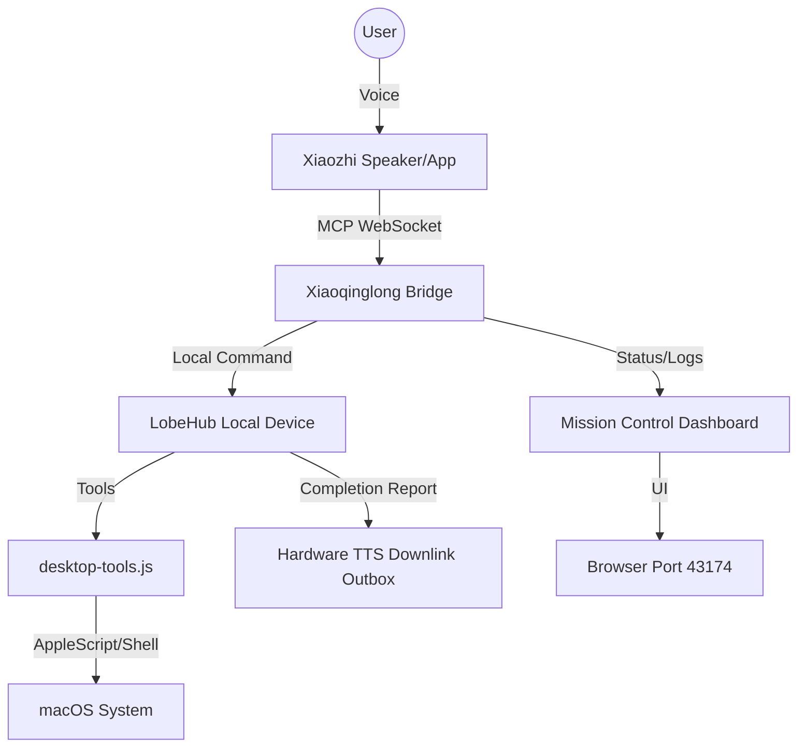

# 小青龙 Xiaoqinglong Voice Assistant

**macOS Local AI Operator Bridge: Xiaozhi Voice + LobeHub Brain + Desktop Tool Execution + Mission Control Dashboard.**

**macOS 本地 AI 操作员桥接器：小智语音入口 + LobeHub 大脑 + 本地桌面工具执行 + Mission Control 控制台。**

[](https://nodejs.org/)
[](docs/SETUP_MACOS.md)
[](SECURITY.md)
[](LICENSE)

---

小青龙语音助手是一个本地优先的 macOS 语音执行桥：小智负责语音入口，Hermes / LobeHub 负责深度推理和本机工具调度，Mission Control 控制台负责查看链路状态、队列、日志和手动测试。

## Architecture



## 3-Minute Quickstart

1. **Install Dependencies:**
   ```bash
   npm install
   ```

2. **Configure Environment:**
   ```bash
   cp .env.example .env
   # Fill in your keys (XIAOZHI_MCP_WS, DOUBAO_ASR_API_KEY, LOBE_AGENT_ID, etc.)
   open .env
   ```

3. **Verify Setup:**
   ```bash
   npm test
   npm run doctor
   ```

4. **Launch Services:**
   ```bash
   # Terminal 1: Frontdoor & Mission Control API
   npm run start:frontdoor

   # Terminal 2: Dashboard UI
   npm run start:panel

   # Terminal 3: MCP Bridge
   npm run start:bridge
   ```

## Configuration

Create `.env` from `.env.example` and fill only local values. Do not commit `.env`.

| Key | Required | Purpose |
| --- | --- | --- |
| `XIAOZHI_MCP_WS` | Yes | Xiaozhi MCP WebSocket endpoint. |
| `DOUBAO_ASR_API_KEY` | Yes | Doubao ASR credential used by the frontdoor. |
| `LOBE_AGENT_ID` | Yes | LobeHub Agent used as the reasoning brain. |
| `XIAOQINGLONG_API_TOKEN` | Yes | Local token for controlled dashboard actions. |
| `XIAOQINGLONG_NOTIFY_TOPIC` | Recommended | LobeHub topic used for immediate task terminal reports. |
| `XIAOQINGLONG_COMPLETION_REPORT_SPEECH` | Optional | Set to `1` on macOS to speak immediate completed/blocked task reports with the local `say` command. |
| `XIAOQINGLONG_COMPLETION_REPORT_NOTIFICATION` | Optional | Set to `1` on macOS to show immediate completed/blocked task reports as system notifications. |
| `XIAOQINGLONG_HARDWARE_TTS` | Optional | Set to `1` to enable the Xiaozhi hardware TTS downlink channel for task terminal reports. |
| `XIAOQINGLONG_HARDWARE_TTS_ENDPOINT` | Optional | Local-only HTTP endpoint that receives hardware TTS payloads. Only loopback hosts such as `127.0.0.1` and `localhost` are accepted. If omitted, reports are queued in `xiaoqinglong-hardware-tts-outbox.json`. |
| `XIAOQINGLONG_HARDWARE_TTS_TOKEN` | Optional | Local token sent as `X-API-Token` to the hardware TTS gateway. |
| `LOBE_CLI_PATH` | Optional | Custom LobeHub CLI path. Defaults to `~/Library/Application Support/LobeHub/bin/lobe`. |
| `XIAOQINGLONG_FRONTDOOR_PORT` | Optional | Frontdoor and Mission Control API port. Defaults to `43173`. |
| `XIAOQINGLONG_PANEL_PORT` | Optional | Mission Control dashboard port. Defaults to `43174`. |
| `XIAOQINGLONG_*_LABEL` | Optional | Existing launchd labels for upgraded local installs. |
| `OBSIDIAN_VAULT_PATH` | Optional | Local vault path for Obsidian-oriented tools. |

`npm run doctor` checks Node.js, required environment keys, JSON config files, the LobeHub CLI path, and local service probes. It reads `.env` and the legacy `doubao-asr-frontdoor.env` used by older local installs, with `.env` taking precedence. Missing configuration is reported as a failure; offline local services are reported as warnings so a clean checkout can still be diagnosed before services are started.

## What it does

- **Voice Entry:** Connects to Xiaozhi MCP WebSocket to bridge voice commands to local tool calls.
- **Local Brain:** Dispatches complex tasks to local LobeHub Agents via LobeHub CLI.
- **Mission Control:** A browser-based dashboard (Port 43174) to monitor the voice link, task queue, watchdog, and high-risk approvals.
- **Proactive Reports:** Completed and blocked tasks can report through LobeHub notify, macOS speech/notifications, and the Xiaozhi hardware TTS downlink outbox or local gateway.
- **Privacy First:** Built-in allowlists for macOS apps, menus, and shortcuts. No logs or task history are uploaded.

## Safe Operating Boundary

This project is designed with a strict local-first philosophy:
- **Intentionally Excluded:** No built-in cloud storage for logs, no automatic syncing of task history, and no remote agent management.
- **Manual Secrets:** All API keys and tokens must be provided manually in `.env` and are never committed to the repo.
- **Port Isolation:** Defaults to `127.0.0.1` on ports `43173` and `43174`.
- **Approval Flow:** High-risk desktop operations (like file deletion or sensitive app control) can be configured to require manual approval in the Control Panel.

The open-source package intentionally excludes personal runtime data: no `.env`, no private Agent IDs, no local task queue, no personal logs, no screenshots, and no machine-specific absolute paths.

## Components

| File | Purpose |
| --- | --- |
| `desktop-tools.js` | Xiaozhi MCP toolset for local actions and LobeHub entry. |
| `doubao-asr-frontdoor.js` | Mission Control API & health checks (Port `43173`). |
| `lobe-dispatch-worker.js` | Background worker for LobeHub task execution. |
| `hardware-tts-downlink.js` | Local-only hardware TTS downlink payload, queue, and gateway delivery layer. |
| `control-panel-server.js` | Static server for the Mission Control UI (Port `43174`). |
| `scripts/doctor.js` | Local environment and readiness checker. |

## Hardware TTS Downlink

The public Xiaozhi MCP bridge lets the cloud call local tools, but proactive hardware speech needs a device-facing TTS path. Xiaozhi ESP32 protocol expects server-side `tts start`, audio frames, and `tts stop`; it is not the same as returning text from a tool call.

This project now includes a safe first-stage downlink layer:

- If `XIAOQINGLONG_HARDWARE_TTS=1` and a loopback `XIAOQINGLONG_HARDWARE_TTS_ENDPOINT` is configured, completed/blocked task reports are posted to that local gateway.
- If the gateway is not configured, reports are queued in `xiaoqinglong-hardware-tts-outbox.json` with evidence visible from Mission Control.
- Non-loopback endpoints are blocked by design, so the dashboard cannot be used to exfiltrate private task content.

The next hardware step is to run or integrate a local ESP32 TTS gateway that accepts these payloads and converts them into the Xiaozhi device protocol audio downlink.

## Development & Testing

```bash
# Run syntax and basic integration checks
npm test

# Run the readiness doctor
npm run doctor

# Run health probes on live services
node scripts/smoke-test.js
```

## Releases

See [CHANGELOG.md](CHANGELOG.md) for release notes.

## License

MIT - See [LICENSE](LICENSE) for details.
