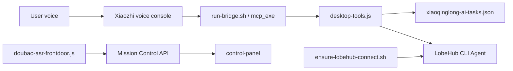

# Architecture

The control panel is intentionally read-mostly. Destructive process control is not enabled by default; users should wire launchd or another supervisor explicitly for their own machine.
